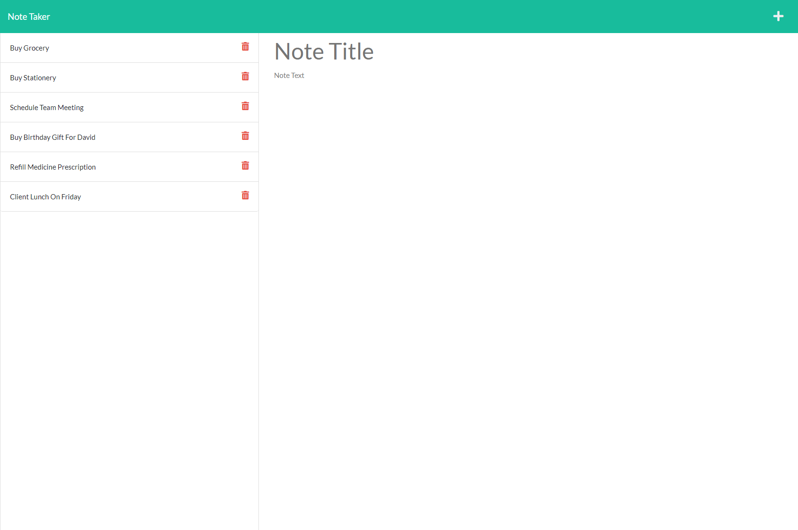
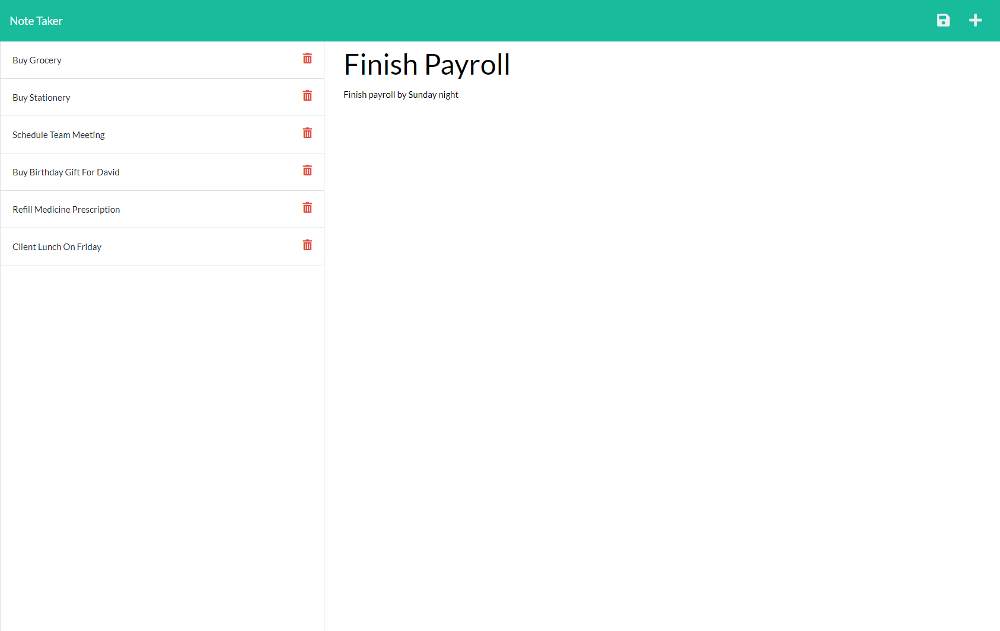

# Note_Taker

## User Story

```
As a small business owner
I WANT: to be able to write and
        save notes
SO THAT: I can organize my thoughts
         and keep track of tasks I need to complete.
```

## Acceptance Criteria

```
GIVEN a note-taking application
WHEN: I open the Note Taker
THEN: I am presented with a landing
      page with a link to a notes page.
WHEN: I click on the link to the
      notes page
THEN: I am presented with a page with existing notes
      listed in the left-hand column, plus empty fields
      to enter a new note title and the note’s text in
      the right-hand column.
WHEN: I enter a new note title and the note’s text
THEN: a Save icon appears in the navigation at the top of
      the page.
WHEN: I click on the Save icon
THEN: the new note I have entered is saved and appears in
      the left-hand column with the other existing notes.
WHEN: I click on an existing note in the list in the
      left-hand column
THEN: that note appears in the right-hand column.
WHEN: I click on the Write icon in the navigation at the
      top of the page
THEN: I am presented with empty fields to enter a new note
      title and the note’s text in the right-hand column.
```

## Mock-Up

---

The following images show the web application's appearance and functionality:


## Getting Started

---

On the back end, the application should include a `db.json` file that will be used to store and retrieve notes using the `fs` module.

The following HTML routes should be created:

- `GET /notes` should return the `notes.html` file.

- `GET *` should return the `index.html` file.

The following API routes should be created:

- `GET /api/notes` should read the `db.json` file and return all saved notes as JSON.

- `POST /api/notes` should receive a new note to save on the request body, add it to the `db.json` file, and then return the new note to the client.

## Added Functionality

---

This application offers the functionality of 'delete' requests.

### Getting Started For Delete Feature

---

- `DELETE /api/notes/:id` should receive a query parameter that contains the id of a note to delete. To delete a note, it's needed to read all notes from the `db.json` file, remove the note with the given `id` property, and then rewrite the notes to the `db.json` file.

## Installation & Usage

---

To install this application, clone the repository to your local directory by using following command:

- git clone https://github.com/Amit-Ranjan22/Note_Taker.git

Once downloaded, you can install its dependencies by navigating to the note-taker's directory on your local machine and issuing the following command:

- npm install

This command will install the following dependencies:

- Express
- uuid

Install Nodemon. It will always restart the server automatically whenever there is a change in the file.

- To install this dependency inside devDependencies use command: 'npm install -D nodemon'.

- Go to your package-json file and inside 'script' add the following: "script": {
  "dev": "nodemon server.js",
  "start": "node server.js"
  },

- Then you can use the following command to start the server: "npm run dev".

- OR instead of using the above three steps, you can install nodemon by using command "npm install -g nodemon" and to run the file, you can use terminal command "nodemon server.js".

## Tests

```
There are no test used for this application.
```

## Screen-Shot of Deployed Application On Heroku

The following images are the screen-shot of the deployed app on Heroku and it shows the web application's appearance and it's functionality:





---

## Link to the deployed Application On Heroku

- Heroku Link: [my-note-taker-application](https://my-note-taker-application.herokuapp.com/)

---

## ©️ License & Copyright

Licensed under the [MIT License](License-Copyright/LICENSE).
